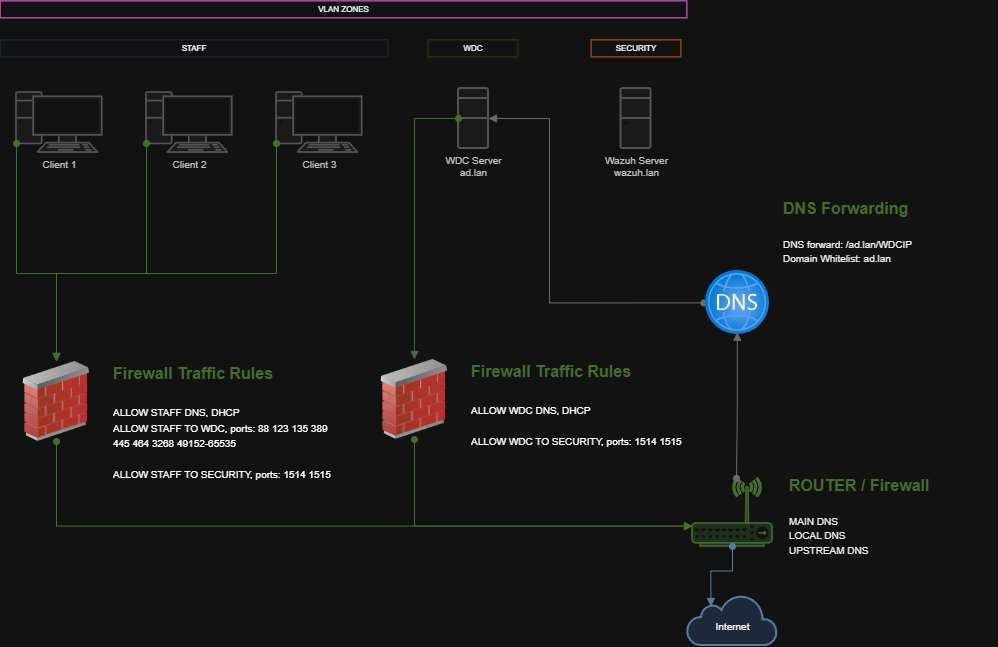

# Windows Server Domain Controller Setup

Describes how to setup WDC and add users.

## Network / Firewall preparation

- Make/Decide WDC VLAN
- Make/Decide Clients VLAN
- Firewall - Reject Incoming by default
- Allow DNS, DHCP ports for both VLANS (53,67)

## Install WDC

1. Deploy VM - Follow [these](https://github.com/juronja/homelab-configs/blob/main/Infrastructure/Proxmox/proxmox-VM-installs.md#windows-server-domain-controller-vm) steps.

2. Setup Static IP, AD, DNS Features, Computer name, Wazuh and Reboot

    Run this script inside Terminal (Administrator)

    ```powershell
    irm https://raw.githubusercontent.com/juronja/homelab-configs/main/OS-Windows/windows-domain-controller/scripts/win-wdc-post-install-1.ps1 | iex
    ```

3. Promote server as DC

    Run this script inside Terminal (Administrator)

    ```powershell
    irm https://raw.githubusercontent.com/juronja/homelab-configs/main/OS-Windows/windows-domain-controller/scripts/win-wdc-post-install-2.ps1 | iex
    ```

4. Enable Remote Desktop

    Server Manager > Local Server > Remote Desktop > Allow RDC

## Firewall and DNS forwarding

- Allow Clients to reach WDC Server ports (88 123 135 389 445 464 3268 49152-65535)
- DNS forward to WDC controller (don't use WDC as DNS). Whitelist domain if needed.



## Add AD users

Server Manager > Tools > Active Directory Users and Computers
...

## Define GPOs

Server Manager > Tools > Group Policy Management
